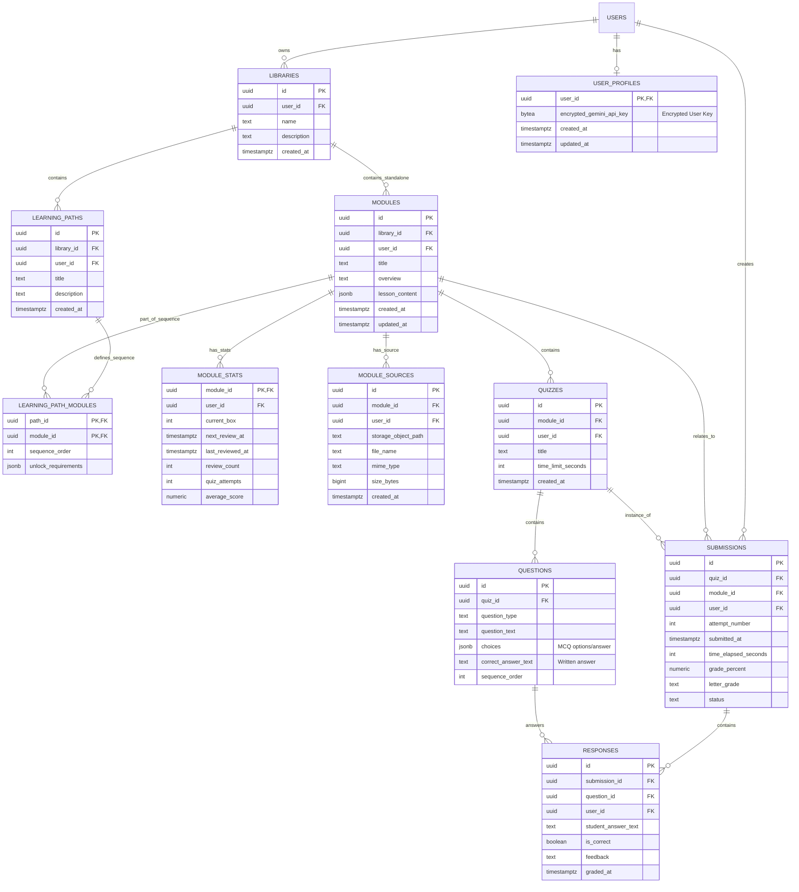

# Noggin Supabase Migration Spike Plan

**Project Goal:** Migrate the Noggin application from an Electron-based, local-filesystem architecture to a Supabase-backed web application, focusing initially on setting up the database, core API, hooks, and authentication.

**Phase 1: Supabase Foundation & Core Feature Migration**

1.  **Define Database Schema (SQL DDL):**

    - Create SQL statements to define the necessary tables in Supabase (PostgreSQL).
    - **Tables:** `user_profiles`, `libraries`, `modules`, `module_stats`, `module_sources`, `learning_paths`, `learning_path_modules`, `quizzes`, `questions`, `submissions`, `responses`.
    - **Primary Keys:** Use v4 UUIDs (`gen_random_uuid()`).
    - **Timestamps:** Use `timestamptz` with `default now()`.
    - **Ownership:** Link tables to users via `user_id uuid references auth.users(id)`.
        - **Note on `user_id` duplication:** We will include the `user_id` column directly on child tables (like `modules`, `quizzes`, `submissions`, etc.) in addition to the parent `libraries` table. This is a form of _denormalization_. It slightly increases data redundancy but significantly simplifies writing Row Level Security (RLS) policies and can improve query performance for common user-specific lookups, as we don't need extra joins just to check ownership.
    - **Gemini Key:** Include `encrypted_gemini_api_key bytea` in `user_profiles`.
    - **Stats:** Use `current_box integer`, `next_review_at timestamptz`, etc., for Leitner stats in `module_stats`.
    - **Relationships:** Define Foreign Key constraints.
    - **Security:** Enable Row Level Security (RLS) on all tables and define basic policies ensuring users can only access/modify their own data (`auth.uid() = user_id`).

2.  **Setup Supabase Project (Dev):**

    - Manually execute the generated SQL DDL in the Supabase Studio SQL Editor for the `noggin-dev` project.
    - Create a Supabase Storage bucket named `noggin-dev-module-sources`.
    - Configure Storage bucket policies (e.g., users can upload/download based on RLS checks on the `module_sources` table).

3.  **Configure Vite Environment:**

    - Create `.env.development` and `.env.production` files in the project root (`c:/Users/andgate/Projects/noggin`).
    - Add `VITE_SUPABASE_URL` and `VITE_SUPABASE_ANON_KEY` variables to both files.
        - Use actual `noggin-dev` credentials in `.env.development`.
        - Use placeholder values in `.env.production` (to be filled in later).
    - Update `src/renderer/src/app/common/supabase-client.ts` to initialize the client using `import.meta.env.VITE_SUPABASE_URL` and `import.meta.env.VITE_SUPABASE_ANON_KEY`.

4.  **Develop API Layer (`src/renderer/api/`):**

    - Create TypeScript functions using the initialized Supabase client.
    - Implement functions for core CRUD operations (Create, Read, Update, Delete) for Libraries, Modules, Quizzes, Submissions, etc., respecting RLS.
    - Include functions for interacting with Supabase Storage (uploading/downloading module source files).

5.  **Develop Hook Layer (`src/renderer/hooks/`):**

    - Create new React hooks using `tanstack-query`.
    - These hooks will wrap the functions defined in the API layer (`src/renderer/api/`).
    - Manage query caching, invalidation, and mutations for interacting with Supabase data.

6.  **Implement Gemini Edge Function:**

    - Create a Supabase Edge Function (e.g., `/functions/call-gemini`).
    - This function will:
        - Receive prompt/data from the client.
        - Identify the calling user (`context.auth`).
        - Retrieve the `encrypted_gemini_api_key` from the user's `user_profiles` record.
        - Decrypt the key server-side (requires setting up the decryption mechanism, potentially using a secret stored in Supabase Secrets for the decryption key itself).
        - Make the API call to Google Gemini.
        - Return the result to the client.

7.  **Implement Core Authentication & Profile UI:**

    - Integrate Supabase Auth UI components or build custom forms for:
        - Sign Up (initially invite-only - requires backend logic/table).
        - Login.
        - Logout.
    - Create a basic user profile page where users can securely input/update their Gemini API key (this interaction will likely involve another Edge Function to handle the encryption before saving to the DB).

8.  **Integrate Core Features into Frontend:**
    - Refactor existing UI components (or create new ones) in `src/renderer/src/` to use the new TanStack Query hooks for data fetching and mutations.
    - Replace Electron API calls (`window.nogginElectronAPI.*`) with calls to the new hooks/API layer.
    - Integrate file upload/display functionality using the Storage API functions/hooks.
    - Connect UI interactions (e.g., taking a quiz, submitting answers) to the appropriate API/hook calls.

**Schema Overview (Mermaid):**

**Future Phases:**

- Implement billing/Stripe integration.
- Build out the invite system and user tier limits.
- Address GDPR/legal requirements thoroughly.
- Develop content sharing features.
- Refactor CI/CD for Cloudflare Pages deployment.
- Comprehensive testing (unit, integration, E2E).
