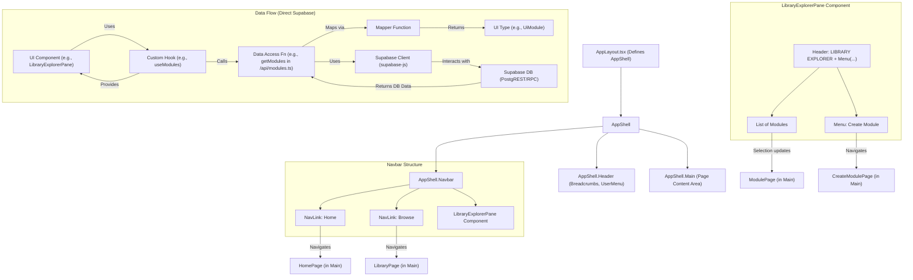

# Noggin Web App - Phase 1 Architecture

**Status:** Finalized
**Date:** 2025-04-12
**Context:** This plan details the initial architecture for migrating Noggin from a desktop app to a cloud-based web application using Mantine v7. It follows up on the high-level goals outlined in `docs/PLAN.md` and incorporates decisions made regarding UI structure, navigation, core concepts, and data access patterns based on user feedback and examples like Quizlet. This version uses direct Supabase interaction via `supabase-js`.

## 1. Core Concepts (Initial Phase)

*   **Implicit User Library:** All content belongs to the user's single, main library space. The explicit, multi-library concept from the desktop app is removed for this initial phase.
*   **Module:** The primary (and initially, only) content type displayed and managed. UI components will use specific `UiModule` types, not raw database types.
*   **Deferred Concepts:** Collections (thematic grouping) and Learning Paths (sequential grouping) are deferred for future implementation phases to simplify the initial build.

## 2. AppShell Structure (`AppLayout.tsx`)

*   Utilize Mantine's `<AppShell>` as the main layout container.
*   **`<AppShell.Header>`:**
    *   Contains the persistent **Breadcrumb Navigation** component (reuse/adapt `AppBreadcrumbs`).
    *   Contains global actions: User Menu (Settings, Logout).
    *   *(Optional: Global Search)*.
*   **`<AppShell.Navbar>`:**
    *   Contains the primary sidebar navigation elements, ordered vertically:
        1.  **"Home" `NavLink`**: Links to the main Dashboard/Practice Feed page.
        2.  **"Browse" `NavLink`**: Links to the `LibraryPage` component (displaying all Modules).
        3.  **`LibraryExplorerPane` Component**: The custom component displaying the list of modules (see below).
*   **`<AppShell.Main>`:** Renders the main page content based on the current route/selection.

## 3. Component Implementation & Naming

*   **`LibraryExplorerPane.tsx`:**
    *   A new or refactored component based on the original `ModuleExplorer`.
    *   **Header:** Displays the static title "LIBRARY EXPLORER" and a triple-dot menu button.
    *   **Menu:** Contains the action "Create Module".
    *   **Content:** Renders a simple, scrollable list of all user Modules (using `UiModule` types).
    *   **Interaction:** Clicking a Module selects it, updating the view in `<AppShell.Main>`.
*   **`LibraryPage.tsx`:**
    *   The existing component, refactored to work without explicit libraries.
    *   Accessed via the "Browse" `NavLink`.
    *   Displays *all* user Modules (using `UiModule` types) in a browsable format (e.g., cards, detailed list). Needs search/filter capabilities.
*   **`AppBreadcrumbs.tsx`:**
    *   Reuse or adapt the existing breadcrumb component to work within the `<AppShell.Header>`.

## 4. Data Access Layer & Data Flow (Direct Supabase Interaction)

*   **UI Types (`src/types/ui/`):** Define UI-specific types (e.g., `UiModule`). Components use these types exclusively for type safety and decoupling from the database schema.
*   **Data Access / Service Functions (`src/api/` or `src/services/`):**
    *   Create modules like `src/api/modules.ts` or `src/services/modules.ts`.
    *   Functions in this layer are responsible for interacting directly with Supabase using the `supabase-js` client library (e.g., `supabase.from('modules').select()`, `supabase.rpc('my_function', ...)`).
    *   They handle fetching raw data (DB types, often `snake_case`) from Supabase tables or calling database functions (RPC).
    *   Implement **Mapper Functions** (e.g., `mapDbModuleToUiModule`) within this layer to transform the raw database results into the defined UI types (`camelCase`).
    *   These functions return the mapped UI types (`UiModule`) or handle errors appropriately.
*   **Custom Hooks (`src/hooks/modules/` or `src/features/modules/api/`):**
    *   Create hooks (e.g., `useModules`) using React Query (`useQuery`, `useMutation`) for state management, caching, and background updates.
    *   Hooks call the Data Access / Service functions to fetch or modify data.
    *   Hooks provide the UI types (`UiModule`) and loading/error states to the UI components.
*   **Component Data Consumption:** UI Components (`LibraryExplorerPane`, `LibraryPage`, etc.) consume data by calling the custom hooks. They remain decoupled from the direct Supabase interaction logic and database schema details, working only with the provided UI types and hook states.

## 5. Backend/Database Changes

*   Remove the `libraries` table from Supabase.
*   Update Supabase API/RLS to allow fetching/managing Modules without a `library_id`.

## 6. Routing

*   Update routes:
    *   Ensure the "Browse" link correctly routes to the `LibraryPage`.
    *   Ensure selecting a module in `LibraryExplorerPane` or `LibraryPage` routes to the correct Module view/page.
    *   Handle routing for the "Home" page and "Create Module" page.

## 7. Diagram

